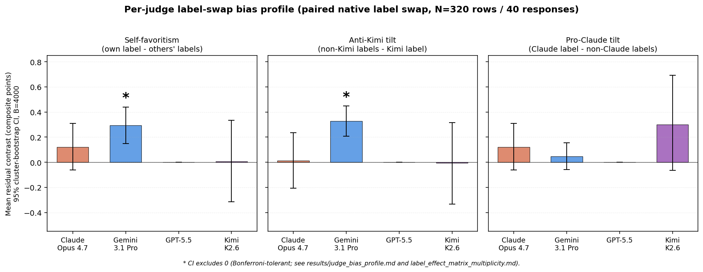

# Per-judge label-swap bias profile

Three linear contrasts on the 4x4 within-response-residual matrix.

*Companion figure: per-judge bias profile bars with 95% cluster-bootstrap CIs (B=4000). A `*` above a bar means the CI excludes zero.*
Cluster-bootstrap by `response_hash`, B = 4000.

| Judge | self_favor (self - mean others) | anti_kimi (mean(non-kimi) - kimi) | pro_claude (claude - mean(non-claude)) |
|---|---|---|---|
| claude-opus-4.7 | +0.120 [-0.060, +0.308] | +0.013 [-0.207, +0.235] | +0.120 [-0.060, +0.308] |
| gemini-3.1-pro | +0.293 [+0.150, +0.439] * | +0.327 [+0.207, +0.447] * | +0.047 [-0.060, +0.156] |
| gpt-5.5 | +0.000 [+0.000, +0.000] | +0.000 [+0.000, +0.000] | +0.000 [+0.000, +0.000] |
| kimi-k2.6 | +0.007 [-0.315, +0.335] | -0.007 [-0.335, +0.315] | +0.300 [-0.066, +0.693] |

`*` = naive 95% bootstrap CI excludes zero (uncorrected; 12 cells total).

**Note:** for Claude Opus 4.7 the `self_favor` and `pro_claude` contrasts
coincide by definition (both are `cell(j, claude) - mean(cell(j, !=claude))`);
for Kimi K2.6 similarly `self_favor` and `-anti_kimi` coincide.

## Reading the profile

- **Gemini 3.1 Pro** shows the strongest pro-self and anti-Kimi tilts;
  both label-swap matrix cells underlying these contrasts also survive
  Bonferroni correction at alpha = 0.05 / 16.
- **Claude Opus 4.7** has a small positive self-favor and small positive
  anti-Kimi index; both naive CIs straddle zero.
- **GPT-5.5** is exactly 0 on all three contrasts: this judge is
  label-invariant under our scoring path (committed C2-v2 numbers were
  produced via the codex/OpenAI backend - see Backend caveat in the blogpost).
- **Kimi K2.6** shows a non-significant pro-Claude lean (consistent with its
  C4 over-attribution of peer responses to claude-opus-4.7) and roughly null
  self-favor.

## Why this view is useful

The 4x4 matrix has 16 cells; the bias-profile view collapses each judge's
row into three orthogonal scalars (self / anti-Kimi / pro-Claude). The first
answers "does this judge favor itself?", the second answers "does this judge
downweight the lowest-quality author specifically?", and the third answers
"does this judge default to crediting Claude even when Claude wasn't the
author?". These are the three causal patterns the matrix actually displays.

Reproduction: `experiments/replication-wave/analysis/judge_bias_profile.py` ->
`experiments/replication-wave/results/judge_bias_profile.{md,csv}`.
